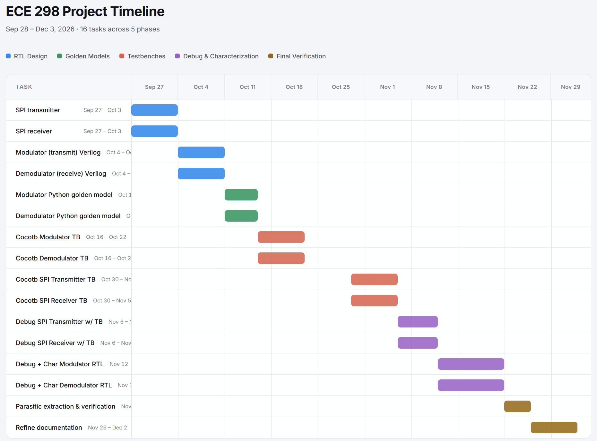

# Project Proposal

## Statement of Purpose

Modulation and demodulation are the processes of varying properties of periodic waveforms in order to transmit and receive signals in RF. One of these methods is frequency shift keying, where signals are represented by differences in frequency. MSK {Minimum shift keying) is a type of continuous-phase frequency shift keying where the difference in frequency between a 1 and 0 is half the bit rate. MSK is particularly effective in data communications as it can provide relatively efficient spectrum usage, allowing for narrower bandwidth. It also has the property of keeping a constant envelope, enabling power amplifiers to be operated in saturation with high efficiency. 

## System Diagram

Two separate components: transmit (modulator) and receive (demodulator). To simplify the design, we are assuming base-band I/Q data at the output of transmit and at input of receive, meaning that the signal is centred around 0 Hz instead of being shifted to some higher frequency.

The bit widths will likely have to be reduced after we synthesize the SPI transceiver and determine how much area is left to implement the remaining logic. It is also likely we will have to remove the transmit or receive section completely.

.png)

### Why it works (or rather, should work…)

Via black magic.

### References

Receive:

- M. K. Simon and C. C. Wang, "Differential detection of Gaussian MSK in a mobile radio environment," in IEEE Transactions on Vehicular Technology, vol. 33, no. 4, pp. 307-320, Nov. 1984, doi: 10.1109/T-VT.1984.24023.
- M. Wei *et al.*, “Design and flight results of the VHF/UHF communication system of Longjiang lunar microsatellites,” *Nature communications*, vol. 11, no. 1. England, p. 3425, July 09, 2020. doi: 10.1038/s41467-020-17272-8.

Transmit:

- D. Brandon and J. Keip, “Efficient FSK/PSK Modulator Uses Multichannel DDS to Switch at Zero Crossings,” *ADI Analog Dialogue*, Nov. 2010. https://www.analog.com/en/resources/analog-dialogue/articles/fsk-psk-modulator-uses-multichannel-dds.html

## I/O Pin Assignment

| **TT Pins** | **Use** |
| --- | --- |
| ui_in[7:0] | Input baseband I/Q data for Receive mode   Unused in Transmit mode |
| uo_out[7:0] | Output baseband I/Q data for Transmit mode   Unused in Receive mode |
| uio[7:0] | uio[0] - Input symbol stream for Transmit mode   uio[1] - Output symbol stream for Receive mode   uio[2] - Transmit/!Receive   uio[4] - CS   uio[5] - MOSI   uio[6] - MISO   uio[7] - SCK |
| clk | Clock |
| rst_n | Active-low reset |

## Proposed Specifications

| **Symbol rate** | 200 kbps |
| --- | --- |
| **Clock** | 30 MHz |
| **Bit error rate (Receive)** | < 0.1% at an Eb/N0 of 10dB |
| **Modulator Input** | Serial 1 bit binary, SPI |
| **Demodulator input** | 4 bit I/Q (total 8 bits), transmitted serially with SPI |
| **Output** | 4 bit I/Q (total 8 bits), transmitted serially with SPI |
| **Sample rate** | 8 samples per symbol |
| **Modulator Latency** | 6 clock cycles - 0.2 us |
| **Demodulator Latency** | 10 clock cycles - 0.33 us |

## Timeline + Division of Work

| **Task** | **Start Date** | **End Date** | **Responsible to** |
| --- | --- | --- | --- |
| SPI transmitter | Sep 28 | Oct 4 |  |
| SPI receiver | Sep 28 | Oct 4 |  |
| Modulator (transmit) Verilog | Oct 5 | Oct 11 | Gracia |
| Demodulator (receive) Verilog | Oct 5 | Oct 11 | Judy |
| Modulator Python golden model | Oct 12 | Oct 16 | Gracia |
| Demodulator Python golden model | Oct 12 | Oct 16 | Judy |
| Cocotb Modulator TB | Oct 17 | Oct 23 | Gracia |
| Cocotb Demodulator TB | Oct 17 | Oct 23 | Judy |
| Cocotb SPI Transmitter TB | Oct 31 | Nov 6 | Gracia |
| Cocotb SPI Receiver TB | Oct 31 | Nov 6 | Judy |
| Debug SPI Transmitter with TB results | Nov 7 | Nov 12 | Judy |
| Debug SPI Receiver with TB results | Nov 7 | Nov 12 | Gracia |
| Debug + Characterize Modulator RTL with TB results | Nov 13 | Nov 22 | Judy |
| Debug + Characterize Demodulator RTL with TB results | Nov 13 | Nov 22 | Gracia |
| Parasitic extraction, back annotation, design verification with Open Road?? | Nov 23 | Nov 26 | Both |
| Refine documentation | Nov 27 | Dec 3 | Both |

Sept 28 - Oct 14: Determine feasibility (not necessarily functional but get idea of area usage) - total 2 weeks, buffered to 2.5 weeks

- Synthesize SPI peripheral for transmitting and receiving to see how much area is left to work with - 1 week
    - More than 10% of area usage - cut down I/Q width to 2 bits each (4 bits total)
    - More than 20% of area usage - remove either transmit or receive completely
- Synthesize transmit - determine max clock frequency from transmit logic alone - 1 week in parallel with synthesizing receive
- Synthesize receive - determine max clock frequency from receive logic alone - 1 week in parallel with synthesizing transmit

Oct 15 - Nov 12: Verify functionality - total 2.5 weeks, buffered to 3 weeks

- Python golden model for transmit section and/or receive section (depending on what we decide to keep) - 1 week
    - For receive section, Python model needs to be able to generate I/Q samples that simulate ideal conditions and configurable noise added so that BER at a particular Eb/N0 can be determined
- Cocotb test bench to compare Python model output with RTL output - 0.5 week
- Debug RTL to actually meet expected outputs from Python model - 2 weeks

Nov 13 - Nov 26: Parasitic extraction, back annotation, design verification with Open Road

Nov 26 - Dec 3: Panic if design doesn’t work, relax otherwise.
