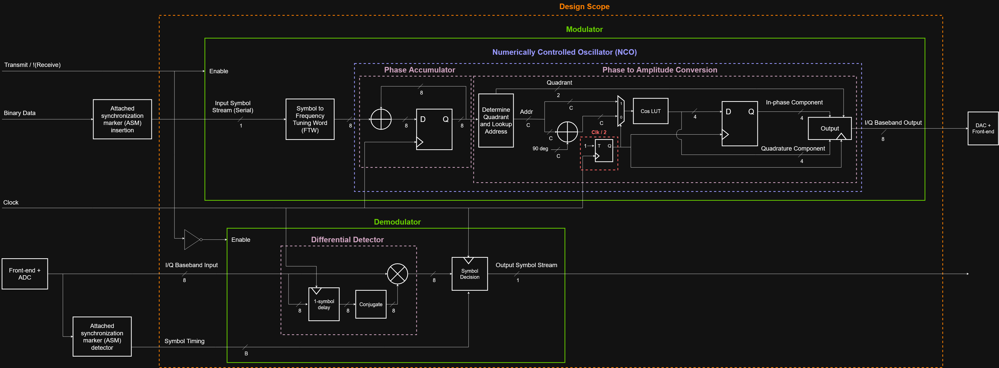
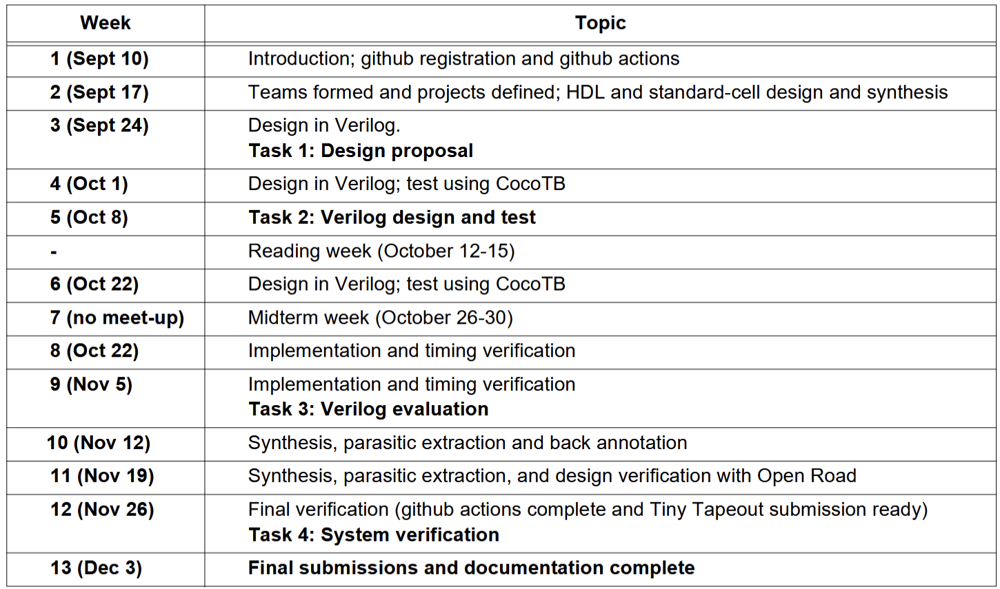

# Project Proposal

## Statement of Purpose

Modulation and demodulation are the processes of varying properties of periodic waveforms in order to transmit and receive signals in RF. One of these methods is frequency shift keying, where signals are represented by differences in frequency. MSK (Minimum shift keying) is a type of continuous-phase frequency shift keying where the difference in frequency between a 1 and 0 is half the bit rate. MSK is particularly effective in data communications as it can provide relatively efficient spectrum usage, allowing for narrower bandwidth. It also has the property of keeping a constant envelope, enabling power amplifiers to be operated in saturation with high efficiency. 

## System Diagram

Two separate components: transmit (modulator) and receive (demodulator). To simplify the design, we are assuming base-band I/Q data at the output of transmit and at input of receive, meaning that the signal is centred around 0 Hz instead of being shifted to some higher frequency.

If area is insufficient, either the transmit or receive branch will be fully removed from the design.

The block diagram also shows attached synchronization marker detection which is copied from what the LongJiang satellite used for frequency and timing estimation in the receive branch. Depending on area availability, we may or may not incorporate that in our design.

### Why it works (or rather, should work…)

Via black magic.

Will add more refined explanation, rough explanation in: https://app.notion.com/p/ECE298A-Digital-MSK-Modem-3ddc4d17240b8034a26df282e3ecc70a

### References

Receive:

- M. K. Simon and C. C. Wang, "Differential detection of Gaussian MSK in a mobile radio environment," in IEEE Transactions on Vehicular Technology, vol. 33, no. 4, pp. 307-320, Nov. 1984, doi: 10.1109/T-VT.1984.24023.
- M. Wei *et al.*, “Design and flight results of the VHF/UHF communication system of Longjiang lunar microsatellites,” *Nature communications*, vol. 11, no. 1. England, p. 3425, July 09, 2020. doi: 10.1038/s41467-020-17272-8.

Transmit:

- D. Brandon and J. Keip, “Efficient FSK/PSK Modulator Uses Multichannel DDS to Switch at Zero Crossings,” *ADI Analog Dialogue*, Nov. 2010. https://www.analog.com/en/resources/analog-dialogue/articles/fsk-psk-modulator-uses-multichannel-dds.html

## I/O Pin Assignment

| **TT Pins** | **Use** |
| --- | --- |
| ui_in[7:0] | Input baseband I/Q data for Receive mode   Unused in Transmit mode |
| uo_out[7:0] | Output baseband I/Q data for Transmit mode   Unused in Receive mode |
| uio[7:0] | uio[0] - Input symbol stream for Transmit mode   uio[1] - Output symbol stream for Receive mode   uio[2] - Transmit/!Receive   Remaining unused |
| clk | Clock |
| rst_n | Active-low reset |

## Proposed Specifications
| **Spec** | |
| --- | --- |
| **Symbol rate** | 200 kbps |
| **Clock** | 12 MHz |
| **Bit error rate (Receive)** | < 0.1% at an Eb/N0 of 10dB |
| **Modulator Input** | Serial 1 bit binary |
| **Modulator Output** | Parallel 4 bit I/Q (total 8 bits) |
| **Demodulator Input** | Parallel 4 bit I/Q (total 8 bits) |
| **Demodulator Output** | Serial 1 bit binary |
| **Sample rate** | 8 samples per symbol |
| **Modulator Latency** | 6 clock cycles |
| **Demodulator Latency** | 10 clock cycles |

## Timeline + Division of Work

| **Task** | **Start Date** | **End Date** | **Responsible to** |
| --- | --- | --- | --- |
| Modulator (transmit) Verilog | Oct 5 | Oct 11 | Gracia |
| Demodulator (receive) Verilog | Oct 5 | Oct 11 | Judy |
| Modulator Python golden model | Oct 12 | Oct 16 | Gracia |
| Demodulator Python golden model | Oct 12 | Oct 16 | Judy |
| Cocotb Modulator TB | Oct 17 | Oct 23 | Gracia |
| Cocotb Demodulator TB | Oct 17 | Oct 23 | Judy |
| Debug + Characterize Modulator RTL with TB results | Oct 24 | Nov 22 | Judy |
| Debug + Characterize Demodulator RTL with TB results | Oct 24 | Nov 22 | Gracia |
| Parasitic extraction, back annotation, design verification with Open Road | Nov 23 | Nov 26 | Both |
| Refine documentation | Nov 27 | Dec 3 | Both |

Stage 1: Determine feasibility (not necessarily functional but get idea of area usage) - total 1 weeks, buffered to 1.5 weeks

- Synthesize transmit - determine max clock frequency from transmit logic alone - 1 week in parallel with synthesizing receive
- Synthesize receive - determine max clock frequency from receive logic alone - 1 week in parallel with synthesizing transmit

Stage 2: Verify functionality - total 2.5 weeks, buffered to 3 weeks

- Python golden model for transmit section and/or receive section (depending on what we decide to keep) - 1 week
    - For receive section, Python model needs to be able to generate I/Q samples that simulate ideal conditions and configurable noise added so that BER at a particular Eb/N0 can be determined
- Cocotb test bench to compare Python model output with RTL output - 0.5 week
- Debug RTL to actually meet expected outputs from Python model - 2 weeks

Stage 3: Parasitic extraction, back annotation, design verification with Open Road

Stage 4: Panic if behind schedule, relax otherwise.
